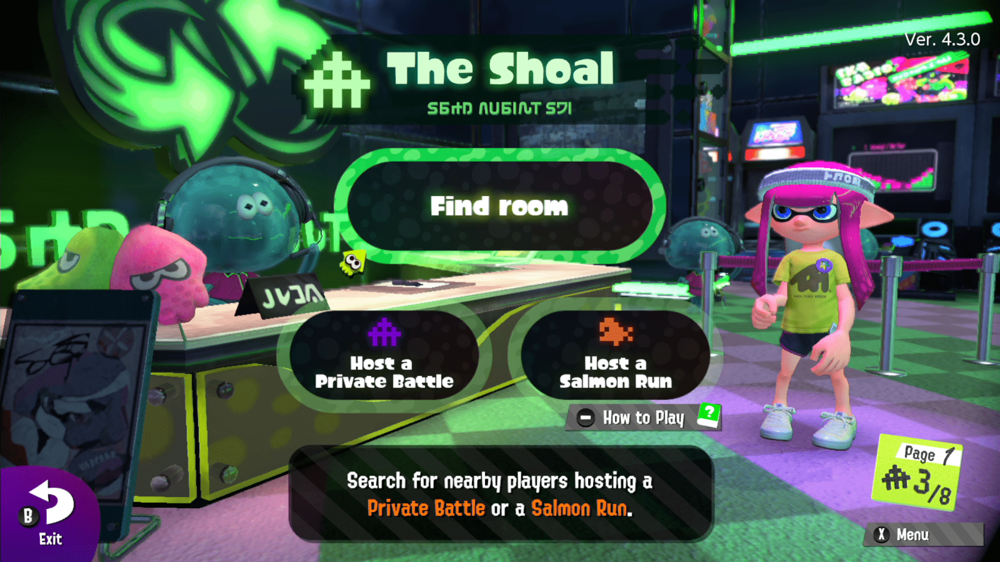
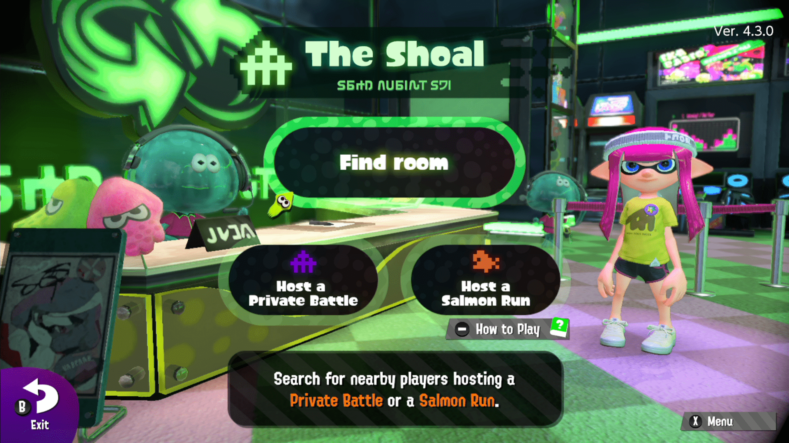

## LanPlay の導入

以下の記事を参考に進めてください。

Windows 版であれば 10 分もあれば環境をつくることができます。

https://tkgstrator.work/?p=5240

## マッチングしない

そもそも部屋に合流できないときの解決策をまとめました。

現状、自分が把握している不具合に関してはおおよそまとめたつもりですが、未知のバグが他にもある可能性があります。

### 部屋が見えない場合(ホストが悪い場合)

相手の部屋が見えない場合、次のどれかの可能性を疑ってください。

ホストが LanPlay になっていない

部屋を立てている人が背景のサーモンがドット絵ではないことを確認してください。

ドット絵になっている場合、LanPlay になっていないので部屋を解散してから再度立ててください。

この画像のように、背景のサーモンがドット絵になっている場合は LanPlay になっていません。

LanPlay であればこのようにオンラインと同じサーモンのアイコンになります。

### 部屋が見えない場合(ゲストが悪い場合)

部屋に参加しようとしている人が部屋が見えない場合、以下の可能性があります。

ゲストが LanPlay になっていない

ゲストが LanPlay になっているかなっていないかは右下のスタンプがあるかどうかで確認できます。

右下にスタンプの表示があり、LanPlay になっていない。

右下のスタンプ表示が消え、LanPlay になっていることがわかる。

### 部屋が見えない場合(どちらかが悪い場合)

LanPlay を二重起動している

パソコンで黒い画面が二重に起動していないことを確認してください。

ニンテンドースイッチが LanPlay に繋がっていない

インターネット設定から IP アドレスが 10.13.XXX.YYY の形になっていることを確認してください。

### 部屋が見えない場合(通信環境の問題)

LanPlay のサーバは東京にあり、LanPlay の通信にはタイムアウト時間というものが決められているので最初のホストを見つけてから、目的のホストを見つけるまでの間にタイムアウトしてしまうことがあります。

例えば、東京で部屋を立てている人が一人いて、アメリカで部屋を立てている人がもう一人いるとします。

このとき、大阪にいる人が部屋を探そうとするとまず最初に東京の部屋を見つけ、その後アメリカの部屋を見つける前に検索がタイムアウトしてしまい「東京の部屋しか見えない」という状況が発生します。

この場合は、別の LanPlay サーバを使うしか解決手段がありません。

### 部屋は見えるが入室できない

IP アドレスが重複している

IP アドレス自体はちゃんとランダムな値にすれば重複する確率は 1/65536 ですが、誕生日とかに設定していると割と被ってしまうのでそういった値は避けるようにしましょう。

物理的な距離が離れている

LanPlay のサーバは東京にあるため、東京から地理的に離れている人がホストをしていると入室していると時間がかかる場合があります。

また、エラーで入室できないこともありますが三回くらい試せば入れたりします。

### 三人目以降が入室できない

ルータの問題

ルータの設定によってはファイアウォールなどの機能のせいで三人目以降が入室できないことがあります。

正直、この問題は解決方法がよく分かっていないです。

バッファローのルータなら間違いなく動くと思うので、よくわからん人はこれを買ってみましょう。

通信の品質の問題

LanPlay には通信速度はあまり重要でなく、遅延(Ping)とパケロス(パケットロス)率が重要になってきます。

これは無線環境だとどうしても悪くなるので、安定して LanPlay をしたい場合はパソコン・ニンテンドースイッチ共に有線にしましょう。

有線接続のチュートリアルは本記事の別の章を参照。

## 回線が落ちてしまう

マッチングはできるが、ゲーム開始から回線が落ちてしまう場合の対処法について解説。

### 二人で遊んだ場合

二オペではよほど通信環境が悪くない限り、ラグや回線落ちは発生しません。

二人で落ちるのであれば、IP アドレスの重複や LanPlay の多重起動を疑ってみましょう。

### 三人以上で遊んだ場合

毎回特定の一人が落ちる

高確率で同じ人が落ちる場合、その落ちる人の環境が良くないケースが多いです。

特に、Wi-Fi で接続している場合は有線の導入を検討してください。

ゲーム開始前の暗転直後の白い画面で落ちる

これも接続している誰かが通信環境が悪い可能性が高いです。

また、このケースの場合はホストの環境が良くない場合があります。

通信不安定と表示される場合

ホストだけこれが表示される場合、ホストの通信環境が良くない可能性が高いです。

ゲストにこれが表示される場合、そのゲストの通信環境（またはゲストとホスト間の通信環境）が良くない可能性が高いです。

## 回線品質が悪い場合の対処法

パソコンとスイッチの両方が無線接続の場合、まずはスイッチの方を有線にすることを第一に考えてください。

なぜなら「パソコンは別にスイッチと同じ部屋にある」という必要はなく「パソコンとルータが同じ部屋、遠くのテレビがある部屋にスイッチ」という環境でも LanPlay が安定するためです。

### ルータを買い換える

ELECOM

不安定なのでおすすめしません。LanPlay で二オペだと普通に遊べるのに三オペ以上になると通信不安定になり、ルータが ELECOM の場合は買い替えをおすすめします。

NEC

不安定なのでおすすめしません。LanPlay で二オペだと普通に遊べるのに三オペ以上になると通信不安定になり、ルータが ELECOM の場合は買い替えをおすすめします。

BUFFALO

基本的にどのモデルでも安定していると言われています。もしも通信不安定が頻出していて原因がルータにありそうな場合、BUFFALO のルータに買い換えることをおすすめします。

### 有線ケーブルを買う

最も確実な解決方法は有線ケーブルと有線 LAN アダプターを購入して、パソコンとスイッチのどちらも有線にすることです。

これ以上確実な対処法はありません。

この二つを無線接続しているパソコンとスイッチの分だけ購入する必要があります。

LAN ケーブルの長さは環境によりけりなのですが、1.5m もあれば十分だと思います。

### 中継機を買う

しかし、場合によってはルータが階下にあるなど、有線接続できないケースがあります。

その場合は中継機を購入するなどして、無線が減衰しないようにします。

また、この中継機は中継機自身に LAN ケーブルを挿すことができます。

中継機はスイッチやパソコンよりも感度が良いので、中継機までは無線接続して、中継機から有線接続にするというのも一つの手です。

## まとめ

それではみなさん、良き LanPlay ライフをお楽しみください。

記事は以上。
